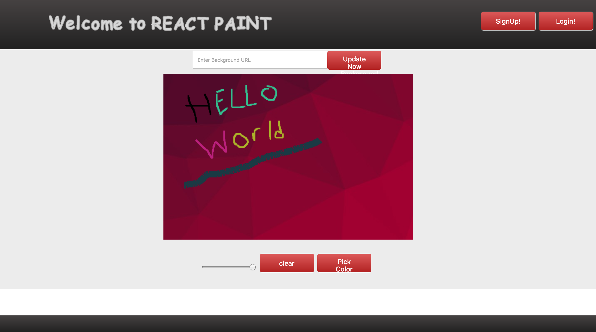
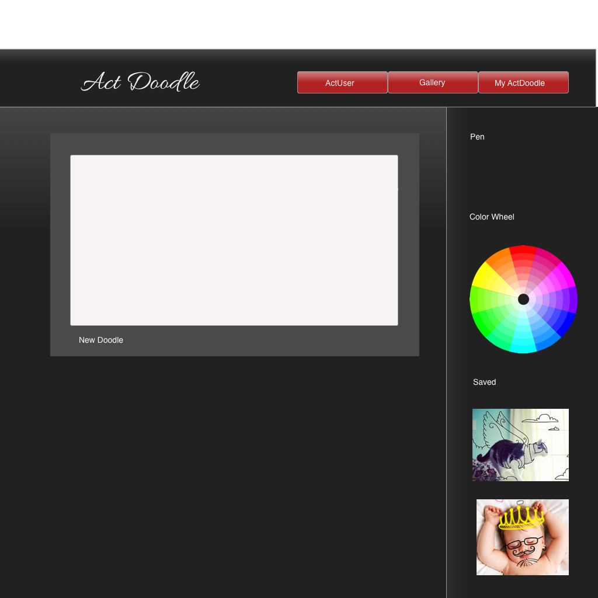
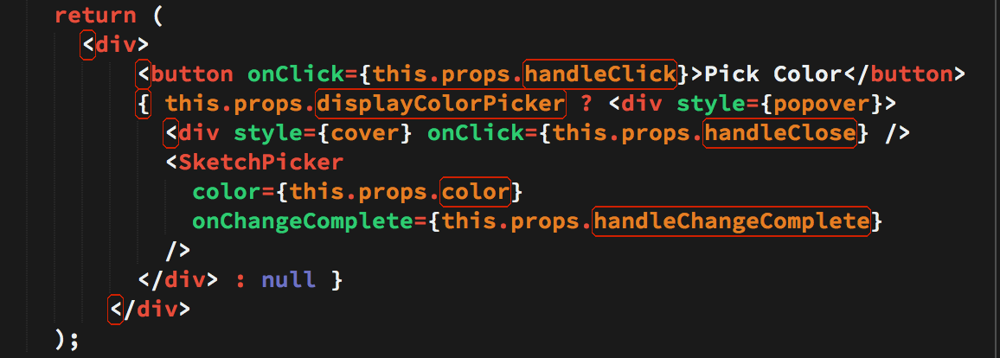
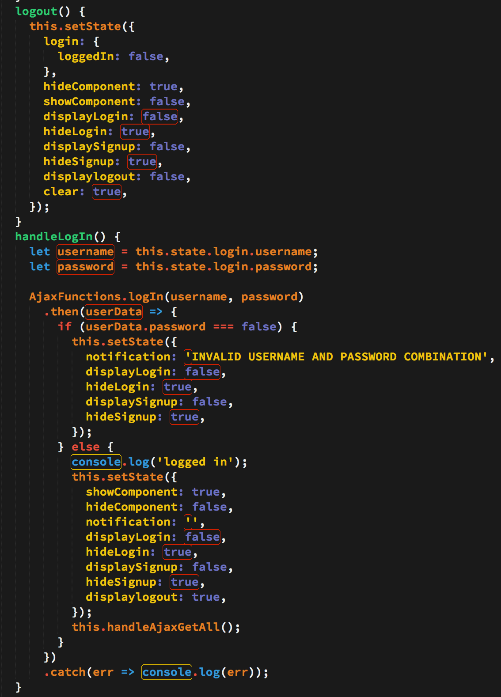

# React Paint

## Description

React application for MS-Paint enthusiasts, allowing users to draw on a background image, save images to a gallery, and view other artists work.

## Functionality

As a Guest

- Draw on a canvas
- Choose a background Image to draw on
- Customize Colors and stroke width to draw

As a User

- Get access to all the functionality included as a guest
- Sign Up or Login to your profile.
- Save your favorite images to your library.
- Retrieve, redraw and remove images from your library.

## App Use

Once the user is signed in to their account, the user can select a background. The user will also have the option to pick whatever colors they want to draw with, change the thinkness of the stroke, and clear the image. A user can can draw on the background image, give the picture a title/description and save it to a public library. Users have the ability to edit images, as well as delete them from the library. Each image in the library is attributed to the user who created it.

## My Approach With This Project

1. Set up MVC/ React framework
2. Install NPM package to allow canvas to display in React
3. Set up the routes
4. Create the database
5. Save, edit, delete images to gallery
5. Login Authentication
6. Style the page

## Wireframe

## Technologies Used

- Node
- Express
- SQL
- Javascript
- React
- Canvas

## Interesting Code

In this code we use a terrinary opperation where onclick of the button, a div either appears or disappears depending on the itial state. Inline style is also applied here where we import the style from a const popover created on the page. Props are used to call states from a parent element.

The logout function uses the true and falses shown to opperate the many turrinaries (descriped in previous code) to allow div's to appear and disappear based on their state. In handleLogin a if else statement is used to only allow users to login if thier information has previously been stored in SQl through the sign up function. If the login is not valid, a notification shows up alerting user to sign up or try typing password again.

## Installation

If viewing this on Heroku, the app should work immediatly, all you need to do is make an account and start using it!

If you are forking it from github, in your terminal window do the command "npm install" to download all the packages needed to get this server to work and add a .env file with your personal information on it. Next create an SQL database and impliment the schema.sql. Open up two terminal windows and put command "nodemon" in one and "npm run watch" in the other. Finally type localhost:3000 into the browser and log into your account!

## Sources

- Jason's, Matt's, Bobby's for help with Heroku
- React Drawable Canvas is the npm package we used as the base of our canvas. We altered their code to allow us to get the canvas context so we can put it into our db.
  - https://www.npmjs.com/package/react-drawable-canvas
- React Color is the npm package we used to alter the color of the line while drawing. Didn't alter this, just imported and used.
  - https://www.npmjs.com/package/react-color
- Bobby's webpack.config for our webpack.
- Canvas Drawing Animation used for the welcome logo on our site. Adapted it to React and altered printing width.
  - http://stackoverflow.com/questions/29911143/how-can-i-animate-the-drawing-of-text-on-a-web-page

## Hurdles

- Deploying on Heroku
- Downloading images from Canvas
- Figuring out how to store canvas data in db
- UserAuth
- Working as a team remotely on Github

## To View

https://react-paint.herokuapp.com/
